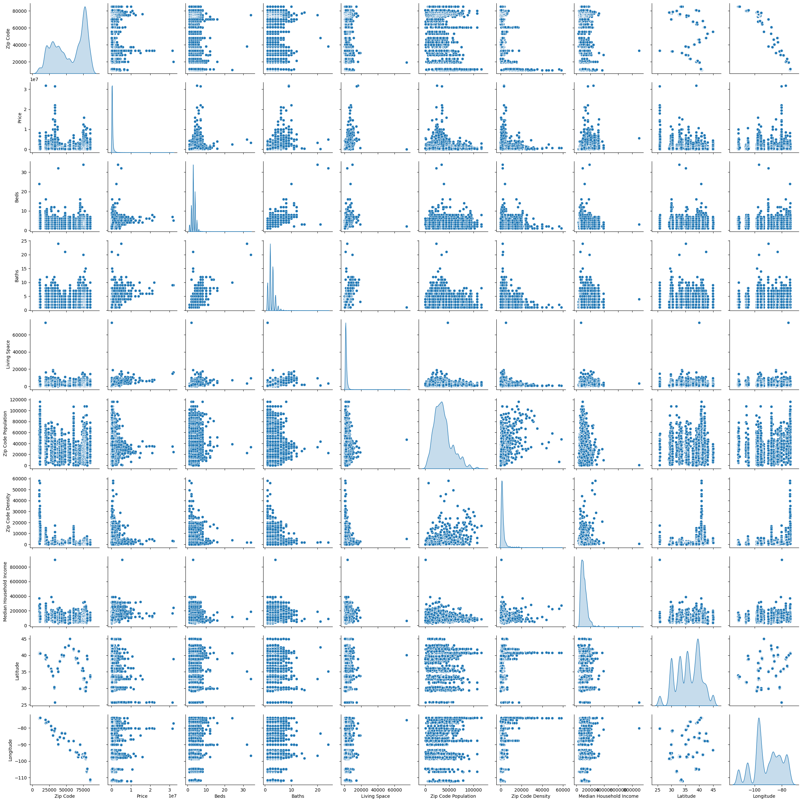
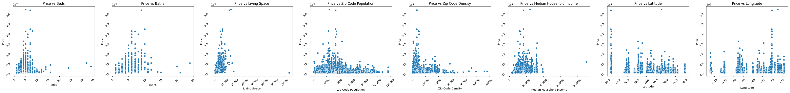
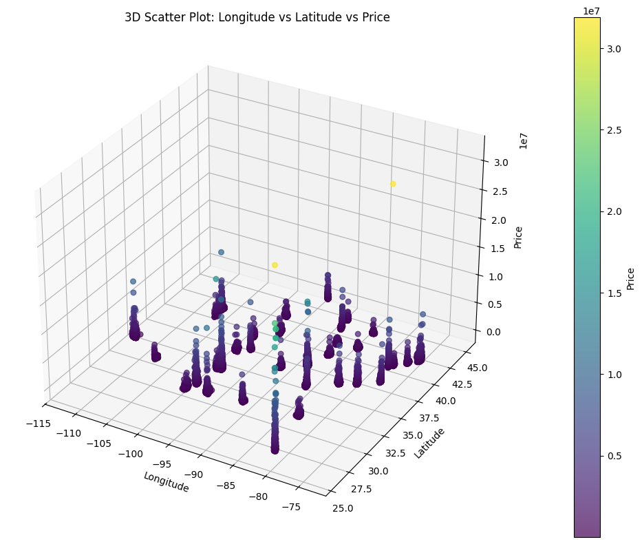
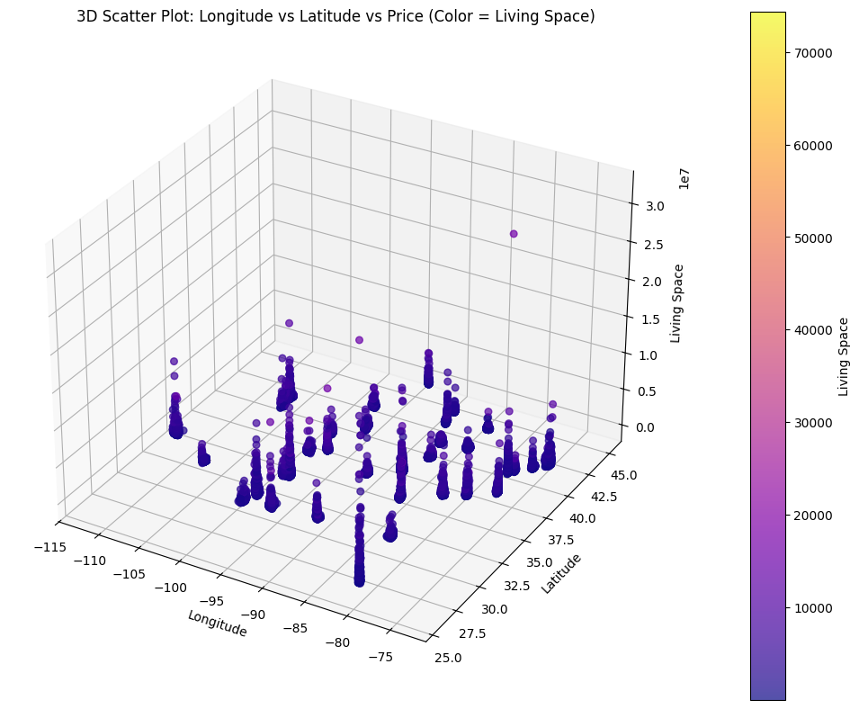

# Laporan Proyek Machine Learning Prediksi Harga Rumah Bedasarkan Data Harga Rumah Amerika - Carolus Christadi Cahyono

## Domain Proyek

Proyek ini berada dalam domain Real Estate dan Data Science, dengan fokus pada prediksi harga rumah di berbagai kota besar di Amerika Serikat. Dengan meningkatnya kebutuhan akan properti dan fluktuasi harga rumah, penting bagi pembeli, penjual, maupun investor untuk memahami faktor-faktor yang memengaruhi harga rumah.

### Mengapa dan Bagaimana Masalah Ini Harus Diselesaikan
Seperti yang dibahas pada tulisan "Determinants of Real House Price Dynamics" [Determinants of Real House Price Dynamics](https://www.nber.org/papers/w9262), 
Prediksi harga rumah yang akurat membantu:
- Investor membuat keputusan berdasarkan data.
- Calon pembeli harga rumah bedasarkan lokasi.
- Pemerintah dan pengembang merancang kebijakan dan proyek pembangunan.
  
Terutama pada peningkatan dasn perubahan harga yang secara dinamika berubah dari beberapa faktor. Model yang dibuat ingin menjadi baseline untuk menentukan harga rumah dari beberapa faktor yang terlihat.
## Business Understanding

### Problem Statements

- Apa saja fitur-fitur demografis dan lingkungan yang paling memengaruhi harga rumah?
- Bagaimana memprediksi harga rumah berdasarkan fitur yang tersedia?

### Goals

- Mengidentifikasi fitur-fitur penting yang memiliki korelasi tinggi terhadap harga rumah : Fitur-fitur pada dataset sering kali tidak dapat digunakan atau mengganggu model. Namun, untuk mengetahuinya, maka dibutuhkan feature selection. Untuk itu, model ingin memilih fitur-fitur terbaik sehingga memudahkan pengambilan data kedepannya.
 
- Membangun model machine learning untuk memprediksi harga rumah : Model akan digunakan untuk memprediksi harga rumah yang dapat membantu buyer, real estate agents, perusahaan, dan pemerintah. Oleh karena itu, model perlu akurasi yang dapat diterima. Karena harga rumah memiliki rentang yang tidak terduga dan faktor-faktor lainnya, maka error dibawah 40% dapat diterima.

### Solution statements

- Mencoba mencari algoritma yang dapat memenuhi problem statement seperti linear regression, XGBoost, dan Neural Network
- Melakukan hyperparameter tuning secara manual atau dengan algoritma seperti Optuna.
- Mengukur performa model dengan metrik Mean Squared Error (MSE) dan Mean Absolute Percentage Error (MAPE) untuk gambaran hasil yang lebih jelas.

## Data Understanding
Dataset diambil dari Kaggle: https://www.kaggle.com/datasets/jeremylarcher/american-house-prices-and-demographics-of-top-cities/data

Dataset ini menggabungkan data harga rumah dan data demografi dari kota-kota besar di Amerika Serikat.
Dataset memuat variabel-variabel :

- Price: Harga properti yang tercantum dalam listing.

- Beds: Jumlah kamar tidur yang disebutkan dalam listing.

- Baths: Jumlah kamar mandi yang disebutkan dalam listing.

- Living Space: Total luas ruang hidup (dalam kaki persegi / square feet) yang tercantum dalam listing.

- Address: Alamat jalan properti.

- City: Kota lokasi properti.

- State: Negara bagian lokasi properti.

- Zip Code Population: Perkiraan jumlah penduduk dalam kode pos tersebut (Sumber: Simplemaps.com).

- Zip Code Density: Kepadatan penduduk per mil persegi dalam kode pos (Sumber: Simplemaps.com).

- County: Kabupaten tempat properti berada.

- Median Household Income: Pendapatan rumah tangga median (Sumber: U.S. Census Bureau).

- Latitude: Garis lintang kode pos (Sumber: Simplemaps.com).

- Longitude: Garis bujur kode pos (Sumber: Simplemaps.com).

## Visualisasi Data

Dalam tahap EDA, dibutuhkan visualisasi untuk mengetahui korelasi antara variabel, maka digunakan function pair plot dari library seaborn untuk melihar korelasi bivariate secara visual.

Karena kita ingin melihat lebih detail kolerasi dengan price maka kita lakukan pair plot dengan price.

Dari hasil pair plot, longitude dan latitude memiliki kolerasi yang unik terhadap price maka kita akan melakukan plotting. Kita akan menggunakan 3D plot yang menunjukan perubahan warna pada axis Y untuk price.

Kita dapat melihat dari plotting tersebut bahwa latitude dan longitude memberikan kumpulan cluster untuk masing-masing rumah(lokasi). Namun, dibutuhkan satu variabel lagi untuk dapat menentukan harga dari setiap cluster tersebut. Karena dari hasil pairplot diatas menunjukan bahwa Bath, Bedroom, dan Living space sangat berkolerasi, kita gunakan living space sebagai feature tambahan.

Kita akan menggunakan 3D plot yang menunjukan perubahan warna pada axis Y untuk living space yang tadinya digunakan untuk price.

Hasil menunjukan adanya pengaruh living space dan features sebelumnya, namun, perbedaan tidak terlihat karena terdapat outlier yang sangat sedikit sehingga warna dari feature living space yang terang tidak terlihat. Oleh karena itu, dibutuhkan data cleaning pada tahap data preparation.

## Data Preparation

Pada data preparation, kita perlu melakukjan beberapa hal 
- Memastikan bahwa tidak ada nilai 0 : Karena kita menggunakan rubik penilaian MAPE yang akan error jika ada nilai 0
- Menghapus Nan values : Menghapus data yang hilang karena pada dataset, data yang hilang sedikit.
- Menghapus outlier pada living space : Menghapus outlier pada living space akan berdampak pada visualisasi dan model regresi yang akan terganggu dengan banyak outler. Kita akan menghapus outlier dengan mencari nilai Quartil yang melewati batas.

### Graphic Longitude Latitude Living Space terhadap Price setelah data cleaning

## Modeling

### Linear Regression
Pemodelan pertama kali menggunakan linear regression, metode regresi yang paling simpel. Namun, setelah melihat tidak adanya perubahan hasil saat penambahan feature, maka model ini tidak bisa mengerjakan kompleksitas yang dibutuhkan.

Dengan melakukan evalusai MAPE dan MSE, model ini mendapatkan nilai 
- Train MAPE: 0.5475 (54.75%)
- Test MAPE: 0.5112 (51.12%)
- Training MSE: 81638204426.59
- Testing MSE: 107104461925.05

Nilai tersebut tidak dapat digunakan sebagai model karena memberikan range error teralu besar.

### XGBoost

Algoritma XGBoost memberikan peningkatan hasil yang jauh lebih baik dibandingkan dengan Linear Regression. Kelebihan ini dapat diprediksi karena algoritma XGBoost adalah implementasi dari teknik Gradient Boosting, yaitu metode boosting di mana model dibangun secara berurutan, dan setiap model baru memperbaiki kesalahan dari model sebelumnya.

Untuk Fitur ['Longitude', 'Latitude', 'Living Space'], mendapatkan hasil

- Train MAPE: 0.3382 (33.82%)
- Test MAPE: 0.3478 (34.78%)
- Training MSE: 16879227636.55
- Testing MSE: 49528296683.06

dan setelah parameter tuning dengan fitur yang sama, terdapat pengurangan error pada test prediction.

- Train MAPE: 0.2444 (24.44%)
- Test MAPE: 0.3362 (33.62%)
- Training MSE: 8930146538.25
- Testing MSE: 51550105885.15

Setelah mengetahui bahwa XGBoost dapat digunakan, feature-feature ditambahkan (Feature Selection) untuk meningkatkan kompleksitas serta hasil

Untuk Fitur ['Longitude', 'Latitude', 'Living Space', 'Median Household Income','Zip Code Population', 'Zip Code Density'], mendapatkan hasil

- Train MAPE: 0.2093 (20.93%)
- Test MAPE: 0.3180 (31.80%)
- Training MSE: 6986084656.88
- Testing MSE: 48439769540.91

Karena hasil yang terlihat overfitting, dilakukan hyper-parameter tuning dengan mengatur learning_rate=0.09. Pengaturan learning rate akan mengatur seberapa cepat model belajar sehingga jika dikurangi maka akan membantu mengurangi overfitting. Hasilnya :

- Train MAPE: 0.2390 (23.90%)
- Test MAPE: 0.3174 (31.74%)
- Training MSE: 8564938701.46
- Testing MSE: 46849245619.81

Setelah itu, digunakan algoritma optuna untuk mencari parameter yang terbaik. Setelah mengatur n_estimators, max_depth, learning_rate, subsample, dan colsample_bytree, model mendapatkan parameter dan hasil sebagai berikut

- Train MAPE: 0.3059 (30.59%)
- Test MAPE: 0.3379 (33.79%)
- Training MSE: 15247458765.28
- Testing MSE: 45596065980.25

### Neural Network
Dengan membentuk CNN, algoritma ini dapat digunakan untuk melakukan regresi. Namun, CNN cenderung lebih lama dan lebih sulit untuk dilakukan tuning ataupun pembentukan layer-layer yang optimal. Hasil yang didapatkan sebagai berikut

- Train MAPE: 0.3314 (33.14%)
- Test MAPE: 0.3622 (36.22%)
- Training MSE: 75680917015.08
- Testing MSE: 94353253191.27

Namun, waktu komputasi untuk epoch yang banyak sangat lama. 

Sebagai hasil, XGBoost dengan feature selection dan hyperparameter tuning memberikan hasil yang paling memuaskan dengan error 31,74% ditinjau dari MAPE.

## Evaluation
Evaluasi menggunakan 2 metrik yaitu

### MSE (Mean Squared Error)

MSE bekerja dengan menghitung selisih antara nilai aktual dan prediksi.
Kemudian, menguadratkan selisih tersebut agar tidak negatif dan memberi penalti lebih besar untuk error besar.
Setelah itu, mengambil rata-rata dari seluruh hasil kuadrat tersebut.

MSE = (1/n) * Σ (y_i - y_hat_i)^2

Keterangan:

- n = jumlah data
- y_i = nilai aktual ke-i
- y_hat_i = nilai prediksi ke-i

Keytakeaways:

- MSE mengukur rata-rata kuadrat selisih antara nilai prediksi dan nilai sebenarnya.
- Semakin kecil MSE, maka model semakin akurat.
- MSE sangat sensitif terhadap outlier karena selisih dikuadratkan.

### MAPE (Mean Absolute Percentage Error)

MAPE bekerja dengan
Untuk setiap data:
- Hitung selisih absolut antara nilai aktual dan nilai prediksi.
- Bagi selisih tersebut dengan nilai aktual untuk mendapatkan kesalahan dalam bentuk persentase.
Kemudian, ambil rata-rata dari seluruh persentase kesalahan tersebut.

MAPE = (1/n) * Σ |(y_i - y_hat_i) / y_i| * 100%

Keterangan:
- n = jumlah data

- y_i = nilai aktual ke-i

- y_hat_i = nilai prediksi ke-i

- Σ = simbol penjumlahan dari i = 1 sampai n

Keytakeaways:

- MAPE mengukur kesalahan prediksi model dalam bentuk persentase dari nilai sebenarnya.
- Semakin kecil MAPE, maka semakin baik model dalam memprediksi nilai yang mendekati data sebenarnya.
- Kelemahan MAPE: Jika ada nilai y_i = 0, maka MAPE tidak bisa dihitung karena terjadi pembagian dengan nol. Solusi biasanya adalah menghapus data dengan target = 0 atau menggunakan metrik lain sebagai pendamping.
- Karena berbentuk presentase, Mape digunakan agar pengguna model dapat dengan mudah meiihat error dibandingkan dengan MSE saja yang memiliki nilai yang besar karena memprediksi harga rumah.

### Hasil akhir model

Model dengan algoritma XGBoost yang utilisasi feature selection dan hyperparameter tuning mendapatkan hasil
- Train MAPE: 0.2390 (23.90%)
- Test MAPE: 0.3174 (31.74%)
- Training MSE: 8564938701.46
- Testing MSE: 46849245619.81

Dari hasil tersebut, model cukup baik melaksanakan kerjanya untuk memprediksi dengan nilai error sekitar 30% dilihat dari metrik MAPE dan MSE digunakan sebagai pendamping karena memberikan gambaran besar tentang seberapa besar kesalahan absolut dalam unit harga. 
